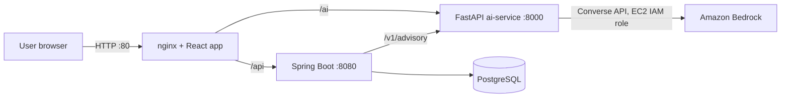

# Rural Financial Advisor

**An AI-driven financial advisor for rural micro-entrepreneurs in India.**

Team **scaleOps** · Built for the *First Commit* hackathon (WeMakeDevs × AWS) · Problem statement **SIH26091**

| | |
|---|---|
| Live demo | http://3.110.177.209 *(hosted on AWS EC2; may be taken down after judging)* |


---

## The problem

A first-time entrepreneur in a village usually does not know how much loan a bank will actually sanction, which government scheme (Mudra, PMEGP) fits their project, or whether the repayment will be affordable. Bank forms and scheme rules are hard to read, and a wrong guess means a rejected application or an unmanageable EMI.

## What it does

The user enters their **location**, **business idea**, **own capital**, **monthly cash flow**, **tenure** and **category**. The app then:

1. **Sizes the loan.** It calculates a maximum safe loan, total project budget and monthly EMI, keeping repayment within a 50% fixed-obligation-to-income (FOIR) cap.
2. **Matches a government scheme** (PM Mudra tiers or PMEGP Rural) and shows the subsidy entitlement.
3. **Assesses credit risk** (low / moderate / high) from the EMI-to-income ratio, with a debt-serviceability summary (DSCR).
4. **Generates an advisory dossier:** a viability verdict, local demand, SWOT, risk factors and stress test, a 90-day launch roadmap, and next steps.
5. **Answers follow-up questions** in an advisory chat (Mudra sanction, DIC endorsement, subsidy release, and so on).

> The live sizing preview uses the same rules as the Spring Boot engine, so it matches the final result.

## Architecture



| Component | Tech | Responsibility |
|---|---|---|
| `frontend/` | React 18, TypeScript, Vite, Tailwind CSS | UI: calculator, appraisal report, advisory dossier, chat |
| `backend/` | Java 17, Spring Boot, Spring Data JPA, PostgreSQL | Source of truth: loan, EMI, scheme and risk calculations; stores plans |
| `llm_service/ai-service/` | Python 3.11, FastAPI, boto3 | AI layer: builds prompts from the validated numbers, calls Amazon Bedrock, returns structured advisory JSON and chat answers |
| `docker-compose.yml`, `frontend/nginx.conf` | Docker Compose, nginx | One-command deployment; nginx serves the app and proxies `/api` and `/ai` |

**Design principle:** the backend is the source of truth for every number. The AI service only explains numbers the backend has already validated, so the language model never invents loan figures.

## How we use AWS

- **Amazon EC2:** the whole stack runs on one `t3.small` instance (Amazon Linux 2023, Mumbai `ap-south-1`) with Docker Compose. Only port 80 is public. The database and services stay on a private Docker network.
- **AWS IAM:** the EC2 instance has an IAM role (`scaleops-ec2-role`). The AI service uses the role's temporary credentials through boto3's default credential chain, so **no AWS keys are stored in the code or the repo**.
- **Amazon Bedrock:** the AI service calls Bedrock through the model-agnostic **Converse API**. The default model is **Amazon Nova Pro** (`apac.amazon.nova-pro-v1:0`), and the model is changed with the `BEDROCK_MODEL_ID` environment variable.

### Current status of the Bedrock integration

The Bedrock integration is implemented and deployed, but **at the time of submission AWS had placed an account-level restriction on our new AWS account.** Bedrock quotas showed 0 and calls returned `ValidationException: Operation not allowed`. We raised this with AWS Support.

While Bedrock is unavailable, the AI service automatically **falls back to a built-in rule-based advisory generator**, so the app stays fully usable. In fallback mode the advisory and chat text is template-based, not model-generated. When the restriction is lifted, the same deployment starts using Bedrock with no code change or rebuild. The service logs `Bedrock advisory generated successfully` when a real model call succeeds.

## Run locally

### Option 1: Docker Compose (recommended)

```bash
git clone https://github.com/iJapmanSingh/rural-financial-advisor.git
cd rural-financial-advisor
cp .env.example .env          # set DB_PASSWORD
docker compose up -d --build
```

Open http://localhost. Without AWS credentials, the AI service uses the fallback generator.

### Option 2: Run each service

```bash
# 1. PostgreSQL: create the database used by the backend
createdb rural_advisory

# 2. Backend (Spring Boot, port 8080). Edit the datasource username/password in
#    backend/src/main/resources/application.properties, or set SPRING_DATASOURCE_* env vars.
cd backend && ./mvnw spring-boot:run

# 3. AI service (FastAPI, port 8000)
cd llm_service/ai-service
python -m venv venv && source venv/bin/activate
pip install -r requirements.txt
python run.py

# 4. Frontend (Vite, port 3000)
cd frontend && npm install && npm run dev
```

To use real Bedrock locally, configure AWS credentials (for example `aws configure`) and set `AWS_REGION` and `BEDROCK_MODEL_ID` (see `.env.example`).

## Deploy on AWS (what we did)

1. Create an IAM role for EC2 with Bedrock access (`AmazonBedrockFullAccess` for the hackathon; scope it down for production).
2. Launch an EC2 instance: Amazon Linux 2023, `t3.small`, 20 GiB gp3, security group allowing SSH (from your IP) and HTTP (80), the IAM role attached, and **metadata response hop limit = 2** so containers can read the role's credentials.
3. Install Docker, the Compose plugin and the buildx plugin, and add a 2 GB swap file.
4. `git clone` the repo, `cp .env.example .env`, set `DB_PASSWORD`, then run `docker compose up -d --build`.
5. Open `http://<public-ip>`.

## API

**Spring Boot** (proxied at `/api`)

| Method | Path | Purpose |
|---|---|---|
| `POST` | `/api/plans` | Calculate loan, EMI, scheme and risk; saves the plan |
| `POST` | `/api/plans/{id}/advisory` | Generate the advisory dossier for a saved plan (calls the AI service) |
| `GET` | `/api/plans/health` | Health check |

**FastAPI AI service** (proxied at `/ai`)

| Method | Path | Purpose |
|---|---|---|
| `POST` | `/v1/advisory` | Structured advisory JSON from validated business and financial inputs |
| `POST` | `/v1/chat` | Advisory chat answer |
| `GET` | `/health` | Health check |

## Team scaleOps

| Member | Contribution | AI tools used |
|---|---|---|
| **Japman Singh** | Backend (Spring Boot, PostgreSQL), integration of all components, AWS deployment | Antigravity, Claude |
| **Harshpreet Kaur** | Frontend (React / TypeScript) | Antigravity, Gemini |
| **Jaspreet Kaur** | LLM / AI service | Gemini Pro |

## AI tools used

As the hackathon rules ask, here is how AI coding tools were used:

- **Claude (Anthropic):** learning AWS services and CLI commands, backend work, and deployment. The Docker / Docker Compose / nginx deployment configuration and the changes that let the AI service use the EC2 IAM role and the Bedrock Converse API were prepared with Claude's help. The team reviewed, ran and tested them.
- **Antigravity:** backend and TypeScript code assistance.
- **Gemini / Gemini Pro:** frontend help and the LLM service.

## Third-party components and credits

We did not copy any application source from other projects. We use open-source libraries and public images, each under its own licence:

- **Frontend:** React, React DOM, TypeScript, Vite, Tailwind CSS, Framer Motion, Lucide React, canvas-confetti, clsx, tailwind-merge
- **Backend:** Spring Boot, Spring Data JPA / Hibernate, PostgreSQL JDBC driver, Maven
- **AI service:** FastAPI, Uvicorn, Pydantic, boto3 / botocore, python-dotenv, requests, httpx, pytest
- **Infrastructure:** Docker and Docker Compose, nginx, PostgreSQL, Eclipse Temurin JDK, Node.js, Python
- **Cloud:** Amazon Web Services (EC2, IAM, Bedrock)

Scheme names and thresholds (PM Mudra, PMEGP) come from publicly available government information.

## Limitations and disclaimer

- Loan figures, subsidy percentages and risk bands are **illustrative estimates**. They are not financial advice and not a bank sanction. Users should confirm scheme rules and eligibility with their bank and District Industries Centre.
- In fallback mode (see *Current status of the Bedrock integration*), advisory text and the reference lines under chat answers are static template text, not live retrieval.
- The demo deployment uses plain HTTP on a single instance. HTTPS, backups and a scoped-down IAM policy would be needed for production.
